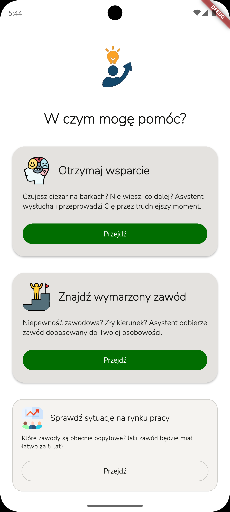
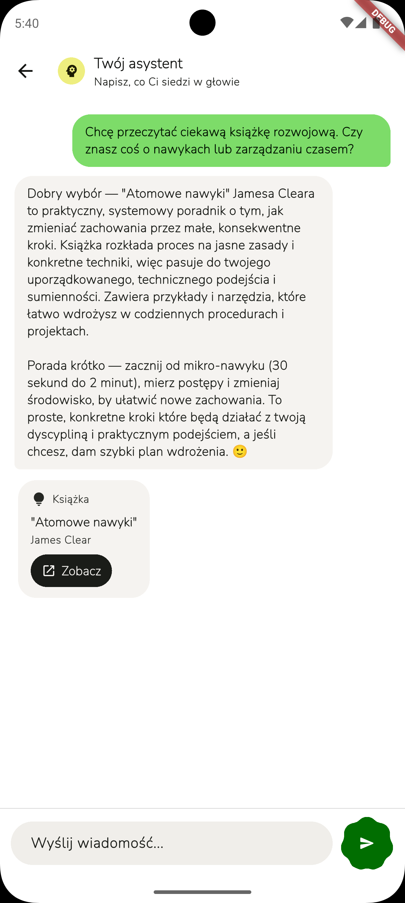
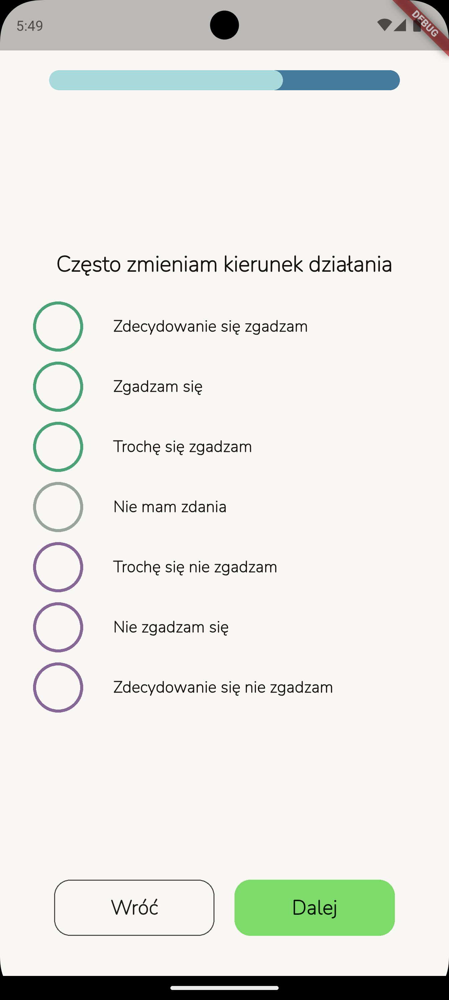
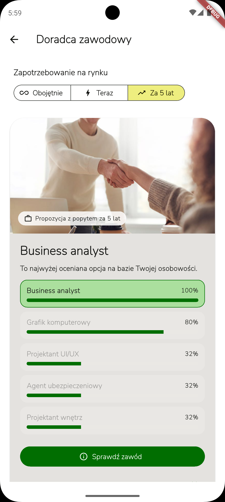

# Your Advisor

> **Odnajdź się we współczesnym świecie**

Your Advisor to aplikacja mobilna stworzona, aby pomóc użytkownikom znaleźć własną ścieżkę kariery lub uzyskać spersonalizowaną pomoc psychologiczną.

**Stworzone w ramach ogólnopolskiego konkursu Hack Heroes 2025**

<p float="left">
  
  
  
  
</p>

---

## Funkcjonalności
- **Dopasowana porada psychologiczna stworzona przez AI** - UX podobne jak w popularnych aplikacjach AI, ale cała magia dzieje się po stronie [backendu](https://github.com/Chorzowsko-radomski-zespol-Hack-Heroes/hackheroes25-advice-service)
- **Test psychologiczny i test zawodowy** - Pozwalają dopasować wszelkie interakcje aplikacji z użytkownikiem
- **Porada Zawodowa** - Spersonalizowana rekomendacja ścieżki kariery
- **Dostępność** - Tryb zwiększonego kontrastu w UI
- **Przejrzyste UI** oparte o Material 3 + Expressive, z trybem zwiększonego kontrastu.
- **Wieloplatformowość** - Planowana pełna obsługa iOS, Windows i macOS. Na razie działa na Androidzie, Linuxie i Webie

---

## Szybki Start

### Wymagania

- **Flutter** 3.38.1 lub wyższa wersja
- **Visual Studio Code**, **Android Studio** (dla Android) **Xcode** (iOS) lub inny kompatybilny edytor
- Konto Supabase

### Instalacja

1. **Sklonuj repozytorium**
   ```bash
   git clone https://github.com/Alex09ander/Your-Advisor.git
   cd Your-Advisor
   ```

2. **Zainstaluj zależności**
   ```bash
   flutter pub get
   ```

3. **Skonfiguruj środowisko**
   - Klucze Supabase są wstępnie skonfigurowane w `lib/main.dart`

4. **Uruchom aplikację**
   ```bash
   flutter run
   ```

   Dla konkretnych platform:
   ```bash
   flutter run -d chrome          # Web
   flutter run -d android         # Android
   flutter run -d ios             # iOS
   flutter run -d linux           # Linux
   ```

   Dodaj flagę `--release` dla zoptymalizowanej wersji aplikacji.

## Wybrane zależności
- **Provider** - Zarządzanie stanem, dependency injection
- **Supabase Flutter** - Logowanie się użytkowników. Backend także korzysta z Supabase.
- **Flutter Secure Storage** - Bezpieczne przechowywanie danych konta gościa
- **Flex Color Scheme** - Paleta kolorów
- **Flutter M3 Shapes** - Kształty Material 3 Expressive
- **Flutter SVG** - Obsługa zdjęć SVG

## Architektura
Aplikacja opiera się na modularnym podziale na warstwy:
- **Warstwa Biznesowa/Domenowa** - Logika biznesowa i interfejsy
- **Warstwa Prezentacji** - Graficzny interfejs użytkownika
- **Warstwa Infrastruktury** - Backend, bazy danych, autentykacja. Konkretne implementacje, np. Supabase czy HTTP.

## Autentykacja
Aplikacja nie wymaga ręcznego logowania się. Użytkownik zostaje automatycznie zalogowany jako gość, natomiast konta te są przechowywane w Supabase.

## Motyw
Aplikacja korzysta z **Material Design 3** z elementami nowo powstałego **Material 3 Expressive**:

- Na razie obsługiwany jest tylko tryb jasny
- Użyto biblioteki `FlexColorScheme` do stworzenia przyjaznego dla oka schematu kolorów